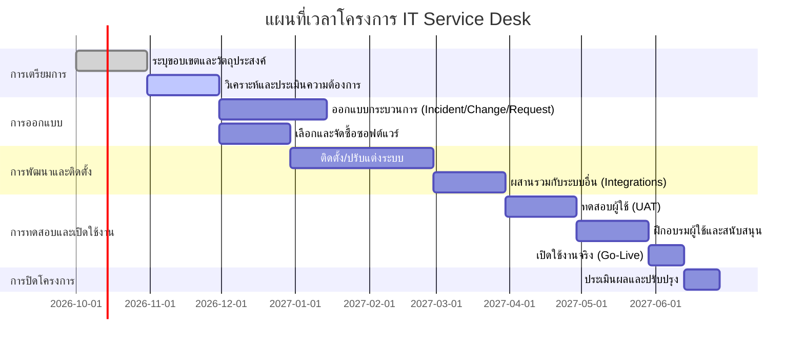

# บทสรุปสำหรับผู้บริหาร (Executive Summary)

โครงการ **IT Service Desk** มุ่งสร้างศูนย์บริการไอทีภายในองค์กรเป็นจุดศูนย์กลางติดต่อ (SPOC) สำหรับการแจ้งปัญหาและขอรับบริการด้าน IT โดยอาศัยกรอบ ITSM ชั้นนำเช่น ITIL v4, ISO/IEC 20000 และ COBIT เพื่อให้แนวปฏิบัติเป็นระบบและสอดคล้องกับมาตรฐานสากล. โครงสร้างทีมควรกำหนดบทบาทชัดเจน (Service Desk Analyst, Manager, ฯลฯ) และจัดทำ skill matrix เพื่อกระจายความรู้และความรับผิดชอบ เช่น ทักษะซ่อมฮาร์ดแวร์ ทักษะเครือข่าย การจัดการสิทธิ์ เป็นต้น. ระบบติดตามเคส (ticketing) ควรเลือกโซลูชันที่ครอบคลุมทั้ง Cloud/On-Prem พร้อมฟีเจอร์อัตโนมัติ, AI/ML, และการผนวกรวม (integrations) ระดับองค์กร ตารางเปรียบเทียบด้านล่างสรุปคุณสมบัติพื้นฐานของเครื่องมือยอดนิยม. การสร้างฐานความรู้ (knowledge base) และระบบบริการตนเอง (self-service) พร้อม chatbots ช่วยให้ผู้ใช้แก้ไขปัญหาง่ายๆ ได้เอง ลดเคสซ้ำซ้อน และสนับสนุนงานเจ้าหน้าที่ให้รวดเร็วขึ้น. นอกจากนี้ ต้องกำหนดข้อตกลงระดับบริการ (SLA) และข้อตกลงการปฏิบัติการภายใน (OLA) ให้ชัดเจน พร้อมใช้กรอบ RACI กำกับความรับผิดชอบในแต่ละกระบวนการ และติดตามตัวชี้วัด (KPI) ผ่านแดชบอร์ดภาพรวม. 

ด้านความมั่นคงปลอดภัย ต้องเข้ารหัสข้อมูล และใช้มาตรการป้องกันข้อมูลรั่วไหล (เช่น บริการเฝ้าระวังข้อมูลบนเครือข่ายมืด) เพื่อให้เป็นไปตามกฎหมายคุ้มครองข้อมูล (GDPR, PDPA) และมาตรฐานต่างๆ. กรณีตัวอย่างจากองค์กรใหญ่พบว่า **FCR** (First Contact Resolution) อาจสูงถึง 75–80% และ **CSAT** (ระดับความพึงพอใจผู้ใช้) สูงกว่า 90% เมื่อระบบบริการมีประสิทธิภาพ. แผนการนำระบบไปใช้งานประกอบด้วยการประเมินความต้องการ, ออกแบบกระบวนการ, คัดเลือกและติดตั้งซอฟต์แวร์, ทดสอบและอบรมผู้ใช้ ตามไทม์ไลน์ Gantt ข้างล่าง โดยระบุระยะเวลางานสำคัญ, ทรัพยากรที่ต้องใช้, และวิธีจัดการความเสี่ยง (เช่น การยอมรับเทคโนโลยี). ในด้านงบประมาณ ควรประเมินต้นทุนรวม (TCO) ครอบคลุมค่าลิขสิทธิ์ ค่าบริการ ใช้บุคลากร และต้นทุนบำรุงรักษา พร้อมทำโมเดล ROI เพื่อเปรียบเทียบผลตอบแทน (เช่น ประหยัดค่าแรงผ่านระบบอัตโนมัติ) อย่างชัดเจน. 

สุดท้ายได้นำเสนอรายชื่อผู้ขายแนะนำพร้อมข้อดีข้อเสียและเกณฑ์คัดเลือก (เช่น ความสามารถของระบบ, ความปลอดภัย, ราคา) รวมถึงแผนการฝึกอบรมและบริหารการเปลี่ยนแปลง (Change Management) เพื่อให้ทีมปรับตัวได้รวดเร็ว. มีแผนปรับปรุงต่อเนื่อง (CIP) โดยจัดประชุมทบทวน KPI สม่ำเสมอ และตัวอย่างแม่แบบสั้นๆ ของ SOP, runbook, SLA, และรายงาน postmortem ให้ใช้เป็นแนวทาง (ดูตัวอย่างด้านท้าย).


## ขอบเขตและวัตถุประสงค์

ขอบเขตของโครงการครอบคลุมการออกแบบและติดตั้งระบบ Service Desk ทั้งกระบวนการแจ้งเหตุ ขอลูกค้าไอที และติดตามแก้ไขปัญหา รวมถึงงานจัดการเหตุการณ์ (Incident), ปัญหา (Problem), การเปลี่ยนแปลง (Change), และการขอบริการ (Request Fulfillment) ตามแนวทาง ITIL. วัตถุประสงค์หลักคือให้เกิด **Single Point of Contact** สำหรับทุกปัญหาและคำขอบริการด้านไอที, ลดเวลาตอบสนองและระยะเวลาแก้ไข, เพิ่มความพึงพอใจผู้ใช้ และสร้างมุมมองเชิงกลยุทธ์เกี่ยวกับคุณภาพบริการ IT ผ่านการวัด KPI. โครงการนี้ยังต้องสอดรับกับนโยบายปกป้องข้อมูล และบรรลุมาตรฐานที่เกี่ยวข้อง เช่น ISO/IEC 20000 (สากลสำหรับ ITSM) และ COBIT (การกำกับดูแล IT).

## กรอบการบริหารและมาตรฐาน ITSM (ITSM Frameworks)

การบริหาร Service Desk ควรอิงหลักการจากกรอบ ITSM ดังต่อไปนี้: 

- **ITIL v4**: กรอบการปฏิบัติที่เป็นที่ยอมรับสูงสุดสำหรับ ITSM เน้นการจัดให้ IT Services สอดคล้องกับความต้องการทางธุรกิจ. ITIL 4 ส่งเสริมหลักการเน้นคุณค่า (Value) และความยืดหยุ่นในกระบวนการ ทีมต้องปรับใช้ Guiding Principles เช่น การร่วมมือ ความเรียบง่าย และการรับฟัง feedback เพื่อให้ระบบคล่องตัว.
- **ISO/IEC 20000**: มาตรฐานนานาชาติสำหรับระบบบริหารบริการ IT (SMS) กำหนดข้อกำหนดขั้นต่ำที่องค์กรต้องมีเพื่อจัดการบริการอย่างมีประสิทธิผล. การได้ ISO20000 ช่วยยืนยันว่า Service Desk มีกระบวนการและโครงสร้างที่ครบถ้วนตามมาตรฐาน.
- **COBIT**: กรอบการกำกับดูแลของ ISACA ที่เน้นการควบคุมวัตถุประสงค์และวัดผลในมิติ IT Governance. COBIT ช่วยให้ Service Desk สอดคล้องกับกลยุทธ์องค์กร ผ่านตัวชี้วัดและโมเดลความสามารถ (maturity models) อย่างมีระบบ (แม้ว่าจะเน้นภาพกว้างกว่ากระบวนการเฉพาะ).
- **กรอบอื่นๆ** (เช่น FitSM, SIAM): หากองค์กรมีกรอบเฉพาะทางอื่น ก็สามารถเสริมได้ (FitSM เน้น ITSM น้ำหนักเบา มี template เอกสาร, SIAM เน้นการผสานระบบหลายผู้ให้บริการฯลฯ).

การเลือกใช้กรอบใดควรพิจารณาจากขนาดองค์กรและวัฒนธรรม เช่น องค์กรใหญ่มักเลือกผสมผสาน ITIL/ISO เพื่อได้ความครอบคลุม, ส่วนองค์กรเล็กหรือกลางอาจเริ่มจาก FitSM หรือแนวปฏิบัติพื้นฐานที่ยืดหยุ่นกว่า. กรอบเหล่านี้ทำให้ทุกขั้นตอนเป็นไปตามแนวทางเดียวกัน และง่ายต่อการปรับปรุงอย่างต่อเนื่อง (CI).

## บทบาท โครงสร้างองค์กร และบุคลากร (Roles, Org Structure, Staffing)

โครงสร้าง **Service Desk** ปกติแบ่งเป็นหลายระดับ เช่น 
1. **Level 1 (First Line)**: เจ้าหน้าที่รับเคสแรกสุด ทำหน้าที่รับสาย โทรศัพท์ อีเมล และ portal queries ทั่วไป เช่น รหัสผ่าน ล็อกอิน ฯลฯ,
2. **Level 2 (Second Line)**: ช่างเทคนิคที่มีทักษะสูงกว่ารับมืองานซับซ้อนเช่น ปัญหา HW/SW เฉพาะทาง,
3. **Level 3 (Third Line)**: ผู้เชี่ยวชาญเฉพาะกิจหรือทีมภายนอก สำหรับเคสที่ต้องแก้ไขระดับลึกหรือเฉพาะทาง,
4. **Service Desk Manager/Supervisor**: บริหารจัดการภาพรวม กำหนด SLA, แก้ปัญหาเชิงกลยุทธ์, รายงาน KPI,
5. **Support Roles**: วิศวกรระบบ เครือข่าย ฯลฯ ที่ร่วมงานผ่านการ escalations.

การจัด Staffing Model ควรพิจารณาจากปริมาณเคสและช่วงเวลา (เช็คแนวการสมัครเข้า-ออกเคส 90 วันย้อนหลังตามที่แนะนำ). ควรใช้ **Skill Matrix** เพื่อดูว่ามีความเชี่ยวชาญใดบ้างในทีม เช่น ทักษะฮาร์ดแวร์, เครือข่าย, การจัดการผู้ใช้ (password, provisioning), ซัพพอร์ตโปรแกรมธุรกิจ, ประสานงานเหตุการณ์สำคัญ, ตอบสนองคำขอบริการทั่วไป เป็นต้น. จากนั้นผสานกับข้อมูลสถิติ เช่น กลุ่มเคสที่มากที่สุด หรือใช้เวลานานที่สุด เพื่อหาช่องว่างทักษะที่ต้องอบรมเพิ่ม. โดยทั่วไปควรมีแผนการเทรนนิ่งเน้นไปยังพื้นที่ที่มีความเสี่ยงสูง (เปิด Dependency สูง ปริมาณมาก) เพื่อลดสถานการณ์ที่พึ่งพาคนเพียงไม่กี่คน. 

นอกจากนี้ต้องกำหนดแผนกะ (shifts) ให้ตรงกับ Pattern ของการเกิดเคส (อาจต้อง staggered shifts ให้ครอบคลุม peak hours) และจัดระบบ assignment อัตโนมัติ (rule-based) ช่วยกระจายเคสตามทักษะและภาระงาน. การตรวจสอบโหลดงานเรียลไทม์ด้วยแดชบอร์ดจะช่วยให้ปรับเปลี่ยนได้ก่อนเกิดปัญหา. สุดท้าย ควรวัดสัดส่วนการใช้ทรัพยากร เช่น tickets/agent, เวลาเฉลี่ย, SLA breach per agent เป็นต้นเพื่อเตือนเมื่อความต้องการเกินกำลัง.

## กระบวนการบริหารจัดการ (Incident, Problem, Change, Request)

Service Desk จะรับผิดชอบกระบวนการหลักของ ITSM หลายอย่าง โดยสามารถสรุปขั้นตอนคร่าวๆ ได้ดังนี้:

- **Incident Management**: เมื่อเกิดเหตุการณ์ (Incident) เช่น ระบบล่ม หรือผู้ใช้เข้าใช้งานไม่ได้ เจ้าหน้าที่ service desk จะบันทึกเคส, จำแนกประเภทและระดับความเร่งด่วน, จากนั้นหาทางแก้ไขเบื้องต้น หากเป็นปัญหาที่ทราบวิธีแก้ก็แก้และปิดเคสได้ทันที. หากไม่ทราบ หรือซับซ้อนก็ส่งต่อ (escalate) ไปยังทีมระดับสูง (2/3rd line). ตัวอย่าง workflow โดยสรุป:
  
  ```mermaid
  flowchart LR
    A[เกิดเหตุการณ์ (Incident)] --> B[บันทึกและจำแนกประเภท]
    B --> C{เป็น Known Error หรือแก้ไขได้ทันที?}
    C -- ใช่ --> D[แก้ไขปัญหาและปิดเคส]
    C -- ไม่ใช่ --> E[ส่งต่อให้ทีมเฉพาะทาง (Escalate)]
    E --> F[วิเคราะห์สาเหตุและแก้ไข]
    F --> D
    D --> G[รายงาน KPI และบทเรียนที่ได้]
  ```
  
  กระบวนการนี้มีเป้าหมายฟื้นฟูการบริการให้เร็วที่สุด (restore service). KPI ที่ใช้วัด ได้แก่ เวลาเฉลี่ยแก้ไข, %FCR (First Contact Resolution), จำนวนเคสค้าง (backlog), SLA Breach Rate เป็นต้น.

- **Problem Management**: บริหารจัดการสาเหตุเบื้องลึกของ Incident. หลังจาก incident เสร็จสิ้น ทีม problem จะรวบรวมข้อมูลวิเคราะห์สาเหตุหลัก (root cause), บันทึก Known Error ไปยังฐานความรู้, และสร้างแผนป้องกันมิให้เกิดซ้ำ (Workaround หรือ permanent fix). กระบวนการ Problem จึงมุ่งลดผลกระทบระยะยาวและจำนวน incident ใหม่ในอนาคต.

- **Change Management**: การจัดการแก้ไขหรือปรับปรุงระบบทั้งหมด เช่น การติดตั้งซอฟต์แวร์ใหม่หรืออัปเกรด. Service Desk จะช่วยบันทึกและประเมิน Change Request ผ่าน Change Advisory Board (CAB) เพื่อตรวจสอบความเสี่ยง ก่อนนำมาดำเนินการตามขั้นตอนอย่างเป็นระบบ. ขั้นตอนทั่วไป ได้แก่ ขออนุมัติ, วางแผน (schedule), ดำเนินการช่วงเวลาที่เหมาะสม (minimize impact), และทดสอบหลังเปลี่ยนแปลง. ตัวอย่างเช่น อัปเกรดระบบปฏิบัติการองค์กรใหญ่ จะต้องมีการสื่อสารแจ้งเตือน, สำรองข้อมูล, ทดสอบก่อน, และติดตามผลหลังปรับใช้อย่างใกล้ชิด. KPI เช่น Change Success Rate (ไม่ล้มเหลวหลัง deploy) และจำนวน Emergency Change (ไม่ผ่านกระบวนการปกติ) เป็นตัววัดคุณภาพ.

- **Request Fulfillment (Service Request)**: คำขอบริการทั่วไป (เช่น ขออุปกรณ์ใหม่, ขอสิทธิ์เข้าใช้งาน) ที่มีขั้นตอนทำซ้ำได้. Service Desk จะมี Service Catalog และ workflow สำเร็จรูปรับมือ เช่น บริการ onboarding พนักงานใหม่ โดยแบ่งหน้าที่ทีมต่างๆ ให้อัตโนมัติ. KPI เช่น ระยะเวลาเฉลี่ยในการตอบสนองคำขอบริการ, %งาน On-Time Delivery เป็นต้น.

ตาราง KPI หลักๆ ที่ควรติดตามประกอบด้วย **จำนวนเคสที่รับได้** (volume), **ระยะเวลาตอบสนองเฉลี่ย**, **อัตราปิดเคสตรงเวลา (ตาม SLA)**, **FCR**, **CSAT**, **อัตราการเลื่อน/ปิดเคสใหม่ (reopen rate)** เป็นต้น. ข้อมูลเหล่านี้นำไปสร้างแดชบอร์ดภาพรวม (เช่น กราฟแท่งจำนวนเคสรายเดือน กราฟวงกลมความสำเร็จตาม SLA) เพื่อวิเคราะห์แนวโน้มและปรับปรุงต่อไป.

## ระบบจัดการเคสและเปรียบเทียบเครื่องมือ (Ticketing Systems)

เครื่องมือซอฟต์แวร์ Service Desk ปัจจุบันมีหลายราย โดยทั่วไปรองรับฟีเจอร์หลักดังนี้: 

- **Ticketing & Service Catalog**: สร้างและจัดหมวดหมู่เคส, มีแบบฟอร์มออนไลน์, บริการพอร์ทัลสำหรับผู้ใช้, และระบบคำร้องขอ (self-service portal).
- **Integrations**: ผสานรวมกับระบบอื่น (เช่น Active Directory, Monitoring Tools, Chat/Slack/MS Teams, Dev Ops Tools) เพื่อรับข้อมูลและตั้งค่าอัตโนมัติ.
- **Automation/AI**: กำหนด workflow อัตโนมัติ (เช่น auto-assign เคส, อนุมัติอัตโนมัติ, ตอบคำถามเบื้องต้นด้วย chatbot), รวมถึงฟีเจอร์ AI/ML ช่วยจัดลำดับความสำคัญและคัดกรองเคส.
- **Knowledge Management**: ฐานข้อมูลความรู้, บทความช่วยเหลือ, FAQs, เชื่อมกับ Wiki/Confluence.
- **Reporting & Dashboards**: รายงานและแดชบอร์ดสำหรับวัด KPI (เช่น SLA adherence, เวลาแก้ไข, CSAT) แบบเรียลไทม์.
- **Security/Compliance**: ระบบควบคุมสิทธิ์ผู้ใช้ระดับละเอียด, เข้ารหัสข้อมูล, รองรับมาตรฐาน (ISO 27001, SOC2, GDPR) และการตรวจสอบหลังบ้าน.
- **Deployment**: บางระบบให้บริการคลาวด์ (SaaS) เช่น ServiceNow, Zendesk, Jira Service Management, Freshservice, SolarWinds ฯลฯ; บางระบบมีรุ่นติดตั้ง (On-Prem) เช่น BMC Remedy ITSM, ManageEngine ServiceDesk Plus.

**ตารางเปรียบเทียบคุณสมบัติเครื่องมือ (ตัวอย่าง)**

| ระบบ/ผลิตภัณฑ์            | รูปแบบ (Cloud/On-Prem) | Integrations (ระบบอื่น)         | Automation/AI                | Security (มาตรฐาน)        | การคิดราคา (ตัวอย่าง)              |
|-------------------------|-----------------------|------------------------------|----------------------------|-----------------------|-----------------------------|
| ServiceNow ITSM         | Cloud (SaaS)         | เชื่อมกับ Microsoft, AWS, Jira, ITOM etc. | Workflow Builder, Virtual Agent, Predictive Intelligence | ISO27001, SOC2, HIPAA | ราคาต่อผู้ใช้งานต่อปี (สูง)<br>ค่าซื้อครั้งแรก + ค่ารายปี |
| Jira Service Management | Cloud/Data Center    | Atlassian Suite, Slack, GitHub, Bitbucket | Automation rules, Jira Assist AI (Confluence integration) | ISO27001, GDPR | Free (3 users) / Std $7 ต่อ agent<br>Premium $14 ต่อ agent |
| Freshservice            | Cloud               | Azure AD, GSuite, AWS, Zoom, etc.           | Freddy AI, workflow automation, chatbot | ISO27001, SOC2        | เริ่มต้น ~$19 ต่อ agent/เดือน (รายปี)        |
| SolarWinds Service Desk | Cloud               | SolarWinds NPM/Azure AD/Slack (จำกัด)       | Workflow, SLA automation   | SOC2, ISO27001         | เริ่มต้น ~$39 ต่อ technician/เดือน (รายปี) |
| ManageEngine SDP        | Cloud/On-Prem       | AD, SSO, Email, Zendesk integration        | Blueprint workflows, AI (Groovy scripts) | ISO27001, GDPR        | เริ่มต้น ~$15 ต่อ agent/เดือน (รายปี)      |
| Zendesk Suite (Support) | Cloud               | Zendesk Chat, CRM, Salesforce, Jira, etc.  | Answer Bot, Macro, SLA automation | SOC2, GDPR, PCI DSS    | เริ่มต้น $19 ต่อ agent/เดือน |
| Spiceworks (On-Prem)    | On-Prem/Cloud-Free  | AD, Inventory Plugins                     | Auto ticket routing (basic) | Limited (basic security) | **ฟรี** (Support model)       |

*หมายเหตุ:* ข้อมูลราคาประเมินโดยประมาณ ตัวเลขจริงขึ้นกับแพ็กเกจและสัญญาจัดซื้อ. เครื่องมือแต่ละตัวมีจุดเด่นต่างกัน เช่น ServiceNow เหมาะองค์กรขนาดใหญ่มีระบบครบวงจรแต่ราคาสูง, JSM เหมาะทีม IT มีการทำงานร่วมกับทีม Dev, Freshservice ใช้งานง่ายเน้นติดตั้งเร็ว, ManageEngine ให้เลือกทั้งบนคลาวด์และไพรเวทเซิร์ฟเวอร์, SolarWinds เน้น reporting ลึก, Zendesk เน้นประสบการณ์ผู้ใช้, Spiceworks เหมาะองค์กรขนาดเล็กงบจำกัด เป็นต้น. 


## การจัดการความรู้และบริการตนเอง (Knowledge Management, Self-Service, Chatbots, Omni-channel)

ระบบ Service Desk ที่ดีต้องมีศูนย์รวมข้อมูลความรู้และช่องทางการติดต่อหลายช่องทาง (Omni-channel) ดังนี้:

- **Knowledge Base:** แพล็ตฟอร์มรวบรวมบทความ, คำแนะนำ, วิธีแก้ปัญหา (FAQs) เพื่อให้ผู้ใช้ค้นหาข้อมูลช่วยเหลือตนเองได้. งานวิจัยชี้ว่า หากมีบทความชุมชนหรือการแก้ปัญหาแนะนำ ผู้ใช้สามารถลดการเปิดเคสซ้ำได้สูง เช่น ตัวอย่างหนึ่งที่ฐานข้อมูลช่วยลดเคสลง 250 เคส/เดือน.
- **Self-Service Portal:** ผู้ใช้สามารถสร้างคำร้องหรือเคสใหม่ ตรวจสอบสถานะของเคสเดิม และเข้าถึงบริการต่างๆ ผ่านเว็บพอร์ทัลหรือโมบายล์แอป.
- **Chatbots/Virtual Agents:** บอตตอบคำถามพื้นฐานหรือสร้างเคสผ่านแชท (web chat, Facebook, Teams, LINE ฯลฯ) ตอบโต้เบื้องต้น เช่น เปลี่ยนรหัสผ่าน, เปิด ticket ใหม่ อัตโนมัติ 24/7 ช่วยลดงานมาตรฐาน.
- **Omni-channel Support:** นอกจากพอร์ทัลแล้ว ควรรองรับการรับเคสจากหลายช่องทาง — โทรศัพท์, อีเมล, แชท (Live Chat/Teams/Slack), Social Media — โดยข้อมูลทั้งหมดถูกรวมเข้าระบบเดียวกัน เพื่อการติดตามที่เป็นหนึ่งเดียว.
- **การจัดการฐานความรู้:** ต้องมี Workflow สำหรับสร้าง/ตรวจสอบเนื้อหาความรู้ เช่น เจ้าหน้าที่สามารถสร้าง *Known Error* และบทความช่วยเหลือใหม่ จากเหตุการณ์ที่พบบ่อยๆ และเผยแพร่ให้ผู้ใช้. ระบบส่วนใหญ่มีคุณสมบัติให้บันทึกเครื่องหมายหรือแท็ก (Tag) สำหรับค้นหาได้ง่าย และเชื่อมต่อกับระบบ Self-Service Portal.

การนำระบบ Self-Service มาใช้ช่วยเพิ่มประสิทธิภาพ เจ้าหน้าที่จะไม่ถูกกวนด้วยเคสที่แก้ได้ด้วยตนเอง ผู้ใช้ก็ได้คำตอบเร็วขึ้นด้วย. เครื่องมือ Service Desk หลายตัว (เช่น **TOPdesk**, **Jira Service Management**, **Zendesk Guide**, **ServiceNow Knowledge**) มีฟีเจอร์เหล่านี้รองรับอัตโนมัติ.

## SLA, OLA, RACI

- **SLA (Service Level Agreement):** ข้อตกลงกับลูกค้า (ผู้ใช้บริการ) ระบุระดับการบริการ เช่น ระยะเวลาตอบสนองครั้งแรก (First Response Time), ระยะเวลารับผิดชอบแก้ไข (Resolution Time) ในแต่ละระดับความสำคัญ. ตัวอย่าง SLA เช่น *“แก้ไขเหตุการณ์ระดับ 1 ภายใน 4 ชั่วโมง”* เป็นต้น. **SLA** ช่วยสร้างความคาดหวังที่ชัดเจนให้ทั้งฝ่ายไอทีและผู้ใช้ โดยจะต้องตรวจสอบและรายงานผลตาม KPI เช่น % SLA ที่เป็นไปตามเป้า.
- **OLA (Operational Level Agreement):** ข้อตกลงภายในระหว่างทีมสนับสนุน เช่น ระหว่าง Service Desk กับทีม infrastructure หรือทีม network. OLA กำหนดความรับผิดชอบและเวลาในการทำงานร่วมกัน เช่น “ทีมเน็ตเวิร์คจะตอบสนองภายใน 2 ชม. เมื่อ Service Desk ยกระดับเหตุการณ์เครือข่าย.” **OLA** ช่วยสนับสนุนการทำให้ SLA บรรลุผลโดยการยืนยันมาตรฐานภายใน.
- **RACI Matrix:** ตารางกำหนดบทบาทว่าใคร Responsible, Accountable, Consulted, Informed ในแต่ละงานหรือกิจกรรมของกระบวนการ. เช่น ในกระบวนการแก้ไขปัญหา (Problem Resolution) อาจกำหนดให้ Service Desk Manager เป็น A, เจ้าหน้าที่วิเคราะห์ปัญหาเป็น R, ผู้อื่น (เช่น Cybersecurity) เป็น C, ฝ่ายผู้ใช้เป็น I เป็นต้น. การมี RACI ช่วยป้องกันความสับสนเรื่องความรับผิดชอบในขั้นตอนต่างๆ.

การรวมข้อมูลเหล่านี้ในกระบวนการช่วยให้สามารถติดตามตัวชี้วัดและปรับปรุงอย่างมีระบบ. เครื่องมือ ITSM ส่วนใหญ่ (เช่น TOPdesk) มีโมดูลจัดการ SLA/OLA และ RACI เพื่อใช้บริหารและรายงานได้สะดวก.

## ตัวชี้วัดและแดชบอร์ด (Metrics & Dashboards)

บริการไอทีควรวัดผลเป็นประจำผ่าน KPI หลัก เช่น: 

- **เวลารับเรื่องเฉลี่ย (Mean Time to Respond)** และ **เวลาปิดเคสเฉลี่ย (Mean Time to Resolve)** – วัดประสิทธิภาพการตอบสนอง-แก้ไข.
- **FCR (First Contact Resolution)** – % ของเคสที่แก้ไขได้ครั้งเดียวจบ (FCR สูงสัมพันธ์กับ CSAT สูง).
- **CSAT (Customer Satisfaction)** – คะแนนความพึงพอใจจากผู้ใช้หลังจบเคส.
- **% SLA ผ่าน** – เปอร์เซ็นต์เคสที่ปิดภายใน SLA ที่กำหนด.
- **Backlog** – จำนวนเคสค้าง (หรือนาน) แบ่งตามประเภทและทีม.
- **Volume Metrics** – จำนวนเคสต่อวัน/สัปดาห์ ตามหมวดหมู่ (Incident/Service Request).
- **Agent Performance** – แบ่งตามเจ้าหน้าที่ เช่น จบเคสกี่เคส, SLA Breach by Agent.

ควรสร้างแดชบอร์ดภาพรวมโดยใช้กราฟหรือบอร์ดกราฟิก เช่น กราฟแท่งแสดงจำนวนเคสรายประเภท, กราฟวงกลมแสดงส่วนแบ่งเคสโดยระดับความสำคัญ, ตัวชี้วัด SLA เป็น gauge chart เป็นต้น. เครื่องมือ ITSM ยุคใหม่ (ServiceNow, Jira, etc.) มักมีแดชบอร์ดในตัว หรือสามารถส่งออกข้อมูลไป BI เครื่องมืออื่นได้. การติดตามแบบเรียลไทม์ช่วยให้จัดการ workload ได้รวดเร็วก่อนเกิดปัญหา.

## ความมั่นคงปลอดภัย ความเป็นส่วนตัว และความเสี่ยงจาก Dark Web

Service Desk ต้องมีมาตรการรักษาความปลอดภัยของข้อมูลผู้ใช้และองค์กร เช่น:

- **การเข้ารหัสข้อมูล:** ข้อมูลส่วนบุคคลและรายละเอียดเคสต้องเก็บอย่างปลอดภัย (ทั้งระหว่างส่งข้อมูลและขณะพัก) ตามมาตรฐานเช่น TLS/SSL.
- **Access Control:** บทบาทและสิทธิ์เข้าถึงข้อมูลในระบบต้องเข้มงวด, ใช้ระบบ Single Sign-On และ Multi-Factor Authentication สำหรับเจ้าหน้าที่.
- **Compliance:** ปฏิบัติตามกฎหมายคุ้มครองข้อมูล (GDPR, PDPA) เช่น จำกัดการเก็บ Log, ให้ผู้ใช้สามารถเรียกร้องข้อมูลของตนได้.
- **Audit Trails:** บันทึก (logging) ทุกการแก้ไขเคสและข้อมูลสำคัญ เพื่อสอบสวนหากมีเหตุการณ์ผิดปกติ.
- **Dark Web Monitoring:** ใช้บริการตรวจสอบ (Threat Intelligence) เพื่อหา ID หรือข้อมูลที่รั่วไหล เช่น Credential ของผู้ใช้ IT ที่อาจถูกขายบน Dark Web และแจ้งเตือนเพื่อเปลี่ยนรหัส. การทำเช่นนี้ช่วยลดความเสี่ยงการโจมตีผ่านช่องทางเหล่านั้น.
- **การรักษาความต่อเนื่อง:** วางแผนกู้คืนข้อมูลเคสสำคัญและฐานความรู้ กรณีระบบล่ม.

หลักปฏิบัติข้างต้นจะช่วยให้ Service Desk ปลอดภัยและเชื่อถือได้ ภายใต้กรอบของมาตรฐานอุตสาหกรรมต่างๆ.

## กรณีศึกษาและมาตรฐานอุตสาหกรรม

ตัวอย่างจากหลายอุตสาหกรรมและองค์กรมีดังนี้:

- **ธนาคารขนาดใหญ่:** มีทีม Service Desk หลายสิบคน ใช้ ITIL อย่างเคร่งครัด วิเคราะห์พบ FCR สูง (~75–80%) และ CSAT >90% เมื่อใช้ระบบอัตโนมัติและการประเมินผลเป็นประจำ. มักมี SLA เคร่งครัด (เช่น ตอบได้ภายใน 30 นาที) เพราะงานมีความเสี่ยงสูง.
- **บริษัทผลิตหรือโรงงาน:** เน้นลด Downtime ของสายการผลิต จึงเน้นทีม support เฉพาะทาง (Production IT), และ SLA ผสมกับ OLA จากทีมวิศวกรรม.
- **องค์กรขนาดกลาง/SMB:** อาจใช้ทีมขนาดเล็ก (5–10 คน) รองรับหลายบทบาท รวมทั้งงานระบบ บางแห่งเลือกเครื่องมือที่ราคาไม่สูง (เช่น Freshservice, ManageEngine) โดยให้ความสำคัญความเรียบง่ายและการใช้งานที่รวดเร็ว.
- **มหาวิทยาลัยหรือหน่วยงานรัฐบาล:** มักทำงานครอบคลุมหลายบริการ (Portal ผู้ใช้, การสนับสนุนห้องคอมฯ) ใช้ระบบ ESM (Enterprise Service Management) ขยายจาก ITIL ไปยังฝ่ายอื่นๆ เช่น HR, การเงิน เพื่อประหยัดงบประมาณและเพิ่มประสิทธิภาพ.

**Benchmark ทั่วไป:** องค์กรที่มี Service Desk ระดับแนวหน้าจะวัดผลเป็นรายงาน (รายเดือน/ไตรมาส) ที่เน้น Trend เช่น อัตราการปิดเคส พึงพอใจ และต้นทุนบริการ. เอกสารอุตสาหกรรมหลายฉบับแนะนำให้องค์กรตั้ง SLA ที่ท้าทายแต่เป็นไปได้ และมีเส้นฐานเปรียบเทียบกับอุตสาหกรรม (Industry benchmarks) เช่น **First Contact Resolution** ควรอยู่ที่ 70% ขึ้นไป, **Average Handle Time** (เวลาในการแก้ไข) ไม่เกิน 1–2 วันทำการสำหรับ incident ทั่วไป. การปรับปรุงมักอ้างอิงกับ KPIs เหล่านี้.

## แผนการย้ายระบบและการใช้งาน (Migration/Implementation Roadmap)

การติดตั้งระบบ Service Desk ควรวางแผนเป็นขั้นตอน โดยกำหนด Milestones และระยะเวลาแต่ละกิจกรรม ตัวอย่างไทม์ไลน์แบบ Gantt:



**ระยะเวลาโดยประมาณ:** ขึ้นอยู่กับขนาดองค์กร — องค์กรใหญ่ควรเผื่อเวลาแต่ละเฟสหลายเดือน (รวมทั้ง Pilot และ Rollout หลายขั้น), องค์กรเล็กอาจเสร็จภายใน 3–4 เดือน. 
**ทรัพยากร:** ทีมโครงการควรประกอบด้วย IT Project Manager, SME ด้าน ITSM, เจ้าหน้าที่ Service Desk ปัจจุบัน, ผู้เชี่ยวชาญระบบ, และซัพพอร์ตจากผู้ขาย/คู่ค้า. 
**ความเสี่ยงและการบรรเทา:** ตัวอย่างความเสี่ยง เช่น การต่อต้านการเปลี่ยนแปลงของผู้ใช้ (ต้องมีแผนสื่อสาร), ปัญหาการบูรณาการกับระบบเดิม (ต้องทดสอบล่วงหน้าพร้อมทีม IT ทั้งหมด), ค่าใช้จ่ายบานปลาย (ทำ ROI ล่วงหน้าและเตรียมสำรอง), และปัญหาทางเทคนิคใหม่ (เตรียมทีมแก้ปัญหาหลัง Go-Live).

## ต้นทุนและโมเดลผลตอบแทนการลงทุน (Cost Estimates & ROI)

การประมาณต้นทุนควรคำนึงถึง **ต้นทุนเบ็ดเสร็จ** (TCO) ดังนี้:

| รายการ                          | ปีที่ 1 (บาท) | ปีที่ 2 (บาท) | ปีที่ 3 (บาท) | หมายเหตุ                   |
|----------------------------------|---------------|---------------|---------------|-----------------------------|
| **ค่าลิขสิทธิ์/สมัครบริการ** (Software Licenses) | 2,000,000      | 2,000,000      | 2,000,000      | ตัวอย่าง: 50 user × $100/user/ปี (~3.3M บาท) |
| **ค่าโครงสร้างพื้นฐาน** (Hardware/Hosting)    | 500,000        | 200,000        | 200,000        | เซิร์ฟเวอร์, สำรองข้อมูล      |
| **ค่าบริการก่อสร้างระบบ** (Implementation)    | 1,000,000      | –             | –             | รวมค่าที่ปรึกษา, ทีมงาน IT, ทรัพยากร    |
| **ค่าฝึกอบรมและ Change Mgmt**               | 300,000        | 100,000        | 100,000        | อบรมเจ้าหน้าที่และผู้ใช้           |
| **ค่าใช้จ่ายบุคลากรเพิ่มเติม**           | 1,200,000      | 1,200,000      | 1,200,000      | เช่น จ้างเพิ่ม 2 FTE (60K/คน/เดือน) |
| **ต้นทุนประจำ (Maintenance)**           | 0             | 400,000        | 400,000        | ปรับปรุงระบบ, สำรองข้อมูลรายปี     |
| **** **รวมต้นทุน (TCO)** **             | 5,000,000      | 3,900,000      | 3,900,000      |                             |
| **ผลประหยัด/คืนทุน** (Savings)       | 0             | 1,800,000      | 1,800,000      | เช่น ลดชั่วโมง OT, ลดงานซ้ำ (ประเมิน) |
| **ROI (%)**                        | –             | 35%           | 70%           | (สมมุติ: คืนทุนใน 3 ปี)        |

*หมายเหตุ:* ตัวเลขในตารางเป็นตัวอย่างสมมุติประกอบการวิเคราะห์ (ขึ้นกับขนาดทีม และค่าแรงท้องถิ่น). การคำนวณ ROI ควรเปรียบเทียบผลรวมต้นทุนกับผลประหยัด (ลด FTE, ลด downtime, เพิ่ม productivity เป็นต้น). การทำ Cost-Benefit Analysis (เช่น Discounted Cash Flow) สามารถเพิ่มรายละเอียดได้.

## ผู้ขายแนะนำและเกณฑ์การเลือก

รายชื่อผู้ขายซอฟต์แวร์ Service Desk ที่น่าสนใจ พร้อมข้อดี-ข้อเสีย และเกณฑ์สำคัญ เช่น:

- **ServiceNow ITSM** – *ข้อดี:* แพลตฟอร์มรวมศูนย์ ครอบคลุมฟีเจอร์ครบ (Incident, CMDB, Change, Asset ฯลฯ) พร้อม AI/Automation ขั้นสูง (Virtual Agent, Performance Analytics). *ข้อเสีย:* ต้นทุนสูง, การปรับแต่งซับซ้อนสำหรับองค์กรเล็ก. **เกณฑ์:** เหมาะกับองค์กรขนาดใหญ่/องค์กรข้ามชาติที่ต้องการมาตรฐานสูง.
- **Jira Service Management (Atlassian)** – *ข้อดี:* ทำงานผสานกับ Jira Software ง่ายดีสำหรับทีม DevOps, มี Marketplace App จำนวนมาก, ราคาถูก (เริ่มฟรีถึง $14/agent). *ข้อเสีย:* อาจต้องใช้ Confluence/Bitbucket เสริมงาน KM, ฟีเจอร์บางอย่างไม่ครบเท่าเครื่องมือเฉพาะทาง. **เกณฑ์:** หากองค์กรใช้ Atlassian อยู่แล้วหรือเน้นการติดตามปัญหาพัฒนาซอฟต์แวร์ควบคู่.
- **Freshservice** – *ข้อดี:* ติดตั้งและใช้งานง่าย, UI สะอาด, มีระบบ ITIL ตามมาตรฐาน, รองรับ AI และ Chatbot. *ข้อเสีย:* ความสามารถลึก (customization) อาจน้อยกว่า ServiceNow. **เกณฑ์:** เหมาะองค์กรขนาดกลางที่ต้องการระบบครบ แต่รีบใช้งานเร็ว.
- **ManageEngine ServiceDesk Plus** – *ข้อดี:* มีทั้งแบบ Cloud/On-Prem, ราคาเป็นมิตร, ฟีเจอร์ ITSM ครบถ้วน เช่น CMDB, Asset Management, Automation. *ข้อเสีย:* UI อาจดูเก่า, Community/คู่มือน้อย. **เกณฑ์:** หากงบประมาณจำกัดหรือมี policy ให้ติดตั้งในเซิร์ฟเวอร์ขององค์กร.
- **SolarWinds Service Desk** – *ข้อดี:* ความสามารถรายงาน (reporting) ขั้นสูง, ผสานกับผลิตภัณฑ์ SolarWinds IT Monitoring ได้ดี, Cloud Native. *ข้อเสีย:* ราคาสูง, เสริม AI น้อยกว่าคู่แข่งบางราย. **เกณฑ์:** เหมาะทีมนักวิเคราะห์ที่เน้นข้อมูลและรายงาน (Dashboard).
- **Zendesk Support Suite** – *ข้อดี:* ออกแบบมาเน้น CX, มีระบบช่วยเหลือลูกค้าระดับโลก, AI Answer Bot, รองรับ omnichannel (email, chat, social). *ข้อเสีย:* ขาดฟีเจอร์เฉพาะทาง ITSM เช่น CMDB, Change Request, ทำนโยบาย ITIL ยากกว่า. **เกณฑ์:** เหมาะใช้เป็น helpdesk ลูกค้าหรือองค์กรเล็กที่ต้องการสื่อสารกับผู้ใช้หลายช่องทาง.
- **Spiceworks (On-Prem/Cloud)** – *ข้อดี:* ฟรี, ง่ายสำหรับบริษัทเล็กๆ, มี community สนับสนุน. *ข้อเสีย:* ฟีเจอร์พื้นฐาน, ไม่มี SLA/Automation ขั้นสูง, บริการลูกค้าหรือ community-based. **เกณฑ์:** องค์กรเล็กสุดที่งบประมาณแทบไม่มี.

**เกณฑ์การเลือกสำคัญ (Prioritized):** ตอบโจทย์กระบวนการ (Incident/Change/KM ฯลฯ), ความเข้ากันได้กับระบบเดิม, การปรับแต่งและขยายได้ (scalability), การสนับสนุนและชุมชนผู้ใช้, ความมั่นคงปลอดภัย, ต้นทุนรวม (TCO) รวมถึงเทคโนโลยีสนับสนุน AI/Automation. การทำ Proof of Concept กับระบบตัวอย่างจะช่วยตัดสินใจเลือกที่เหมาะสมที่สุด.

## แผนการฝึกอบรม การเปลี่ยนแปลง และการปรับปรุงต่อเนื่อง

- **Training:** จัดอบรม (workshops) สำหรับเจ้าหน้าที่ Service Desk ทั้งหมดเกี่ยวกับกระบวนการใหม่, การใช้เครื่องมือ, และแนวทางปฏิบัติ (SOP). ควรมีคู่มือผู้ใช้สั้นๆ (Quick Reference) และอบรมให้กับผู้ใช้ทั่วไปในองค์กรเกี่ยวกับวิธีใช้ Self-Service Portal และช่องทางติดต่อใหม่.
- **Change Management:** ใช้วิธีค่อยเป็นค่อยไป (phased rollout) พร้อมสื่อสารอย่างสม่ำเสมอว่าผู้ใช้จะได้รับประโยชน์อย่างไร. ใช้กลยุทธ์ ADKAR (Awareness, Desire, Knowledge, Ability, Reinforcement) เพื่อประเมินการยอมรับ. หลีกเลี่ยงการวัดผลทีมในระยะแรกที่ตึงเครียด (เช่น ไม่ตั้งเป้า SLA สูงสุดทันที) เพื่อเปิดโอกาสให้คุ้นชิน.
- **Continual Improvement (CIP):** วางกลไก PDCA (Plan-Do-Check-Act) โดยทีม Service Desk ควรมีการประชุมทบทวนประสิทธิภาพ (CAI: Continual Service Improvement Meeting) อย่างน้อยทุกไตรมาส. ใช้ข้อมูลจาก Dashboards และ feedback ของผู้ใช้เพื่อระบุช่องว่าง เช่น หัวข้อในฐานความรู้ที่ควรเพิ่มเติม, กระบวนการที่ควรปรับลดขั้นตอน, ตัวอย่างการตรวจสอบเรียกว่า CSI Register. แนะนำให้กำหนดเจ้าหน้าที่รับผิดชอบประจำด้านการปรับปรุง (CSI Manager/Champion).

## แม่แบบตัวอย่าง (Templates)

ตัวอย่างโครงสร้างแบบสั้นของเอกสารสำคัญ:

- **SOP (Standard Operating Procedure) ตัวอย่าง:**  
  **ชื่อ SOP:** ตรวจสอบระบบหลังวันหยุดยาว  
  **วัตถุประสงค์:** เพื่อให้มั่นใจว่าระบบไอทีทำงานปกติหลังหยุดยาว  
  **ขอบเขต:** Service Desk และทีม Infrastructure  
  **วิธีดำเนินการ:**  
  1. ส่งทีมตรวจสอบระบบเช้าวันทำงานแรก  
  2. ทดสอบ login, network, application สำคัญ  
  3. หากพบปัญหาแจ้งทีมแก้ไขทันที  
  4. รายงานผลการตรวจสอบให้ผู้จัดการทราบ  
  **ผู้มีบทบาท:** Service Desk Analyst (R), Service Desk Manager (A), Infra Team (C), ฝ่ายผู้ใช้ (I)  

- **Runbook ตัวอย่าง:**  
  **ชื่อ Runbook:** แก้ไขปัญหาเครื่อง PC เปิดไม่ติด  
  **รายละเอียด:**  
  1. เรียกสอบถาม user ถึงอาการ (เช่น ไฟไม่ติด, เสียงพัดลม, ขึ้น error บนจอ)  
  2. ตรวจสอบปลั๊กและ UPS (หากใช้)  
  3. ลองสตาร์ทเครื่อง Safe Mode เพื่อดู error message  
  4. หากมี error code, ค้นฐานความรู้หาวิธีแก้ไขเบื้องต้น  
  5. บันทึกผลและอัพเดต ticket  

- **SLA Template ตัวอย่าง:**  
  *SLA Level 1:*  
  - *Service:* แก้ไขระบบล่ม  
  - *Response Time:* เริ่มดำเนินการภายใน 15 นาที  
  - *Resolution Time:* แก้ไขภายใน 4 ชั่วโมง (หากไม่สามารถแก้ได้, รายงาน Root Cause ภายใน 1 วันทำการ)  
  *SLA Level 2:*  
  - *Service:* แก้ไขปัญหาใช้งานช้า  
  - *Response Time:* 30 นาที  
  - *Resolution Time:* 8 ชั่วโมง  

- **Incident Postmortem ตัวอย่าง:**  
  **หัวข้อ:** แจ้งเหตุระบบ CRM ล่มเมื่อ 2026-06-15  
  **สรุปเหตุการณ์:** วันที่ 15 มิ.ย. เวลา 10:00 ระบบ CRM หยุดทำงาน เจ้าหน้าที่แจ้งเหตุและแก้ไขได้ภายใน 2 ชั่วโมง  
  **สาเหตุ:** บั๊กในโปรแกรมหลังอัปเดตระบบ ระบบกลับมาใช้งานได้หลัง rollback  
  **ผลกระทบ:** ผู้ใช้ไม่สามารถบันทึกข้อมูลลูกค้าใหม่ประมาณ 50 เคส  
  **Action Items:** กำหนดขั้นตอนทดสอบโปรแกรมก่อนปล่อยจริงทุกครั้ง, อัปเดตฐานความรู้และแจ้งเตือนทีมพัฒนาล่วงหน้า

    
**อ้างอิง:** แนวทางปฏิบัติจากกรอบ ITIL v4, เอกสาร ISO/IEC 20000, บทความเชิงปฏิบัติของ TOPdesk และ Atlassian รวมถึงรายงานอุตสาหกรรมต่างๆ.